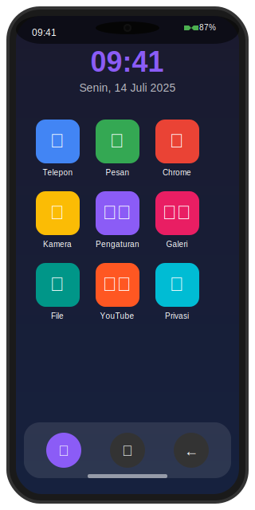
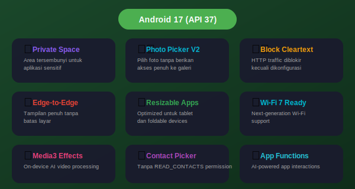
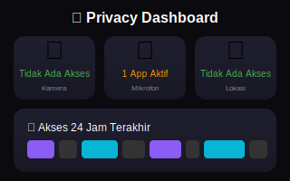
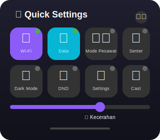

# 🌟 AuroraOS - Custom Android ROM




> **AuroraOS** - Sistem operasi Android kustom berbasis **NusantaraProject** dengan foundation **Android 17 (API 37)**. Dirancang untuk pengalaman pengguna yang superior dengan fitur privasi, performa, dan kustomisasi terdepan.

---

## 🎯 Tentang AuroraOS

AuroraOS adalah custom ROM Android yang dikembangkan untuk memberikan pengalaman Android murni yang dioptimalkan dengan fitur-fitur canggih. Nama "Aurora" terinspirasi dari fenomena cahaya aurora yang indah dan memukau, mencerminkan keindahan dan keunikan pengalaman pengguna yang kami tawarkan.

### ✨ Keunggulan AuroraOS


| Keunggulan | Deskripsi |
|------------|-----------|
| 🔒 **Privasi Terdepan** | Fitur privasi enhanced dengan kontrol penuh atas data Anda |
| ⚡ **Performa Optimal** | Optimasi sistem untuk responsivitas dan efisiensi baterai |
| 🎨 **Kustomisasi Luas** | Beragam opsi kustomisasi untuk personalisasi penuh |
| 🌏 **Multi-Bahasa** | Dukungan Bahasa Indonesia dan 50+ bahasa lainnya |
| 🔄 **Update Cepat** | Mendapat update keamanan secara berkala |

---

## 📋 Daftar Isi

- [🌟 Tentang AuroraOS](#-tentang-auroraos)
- [🚀 Fitur Utama](#-fitur-utama)
- [📦 Fitur Android 17](#-fitur-android-17)
- [🛠️ Prasyarat Build](#️-prasyarat-build)
- [💾 Instalasi](#-instalasi)
- [🔨 Langkah-Langkah Build](#-langkah-langkah-build)
- [🎨 Kustomisasi](#-kustomisasi)
- [📁 Struktur Repository](#-struktur-repository)
- [❓ FAQ](#-faq)
- [🤝 Kontribusi](#-kontribusi)
- [📜 Lisensi](#-lisensi)
- [🙏 Kredit](#-kredit)
- [🔗 Link Berguna](#-link-berguna)

---

## 🚀 Fitur Utama



### 🔒 Keamanan & Privasi

- Privacy Dashboard dengan kontrol granular
- Photo Picker tanpa akses galeri penuh
- Block cleartext traffic secara default
- Enhanced SELinux policies
- App Sandbox yang diperkuat
- Biometric authentication enhancement

### ⚡ Performa & Optimasi

- Memory management yang dioptimalkan
- VM tuning untuk responsivitas
- Network buffer optimization
- Display performance tuning
- Battery saver enhancement
- App Functions untuk AI-powered features

### 🎨 Kustomisasi UI/UX

- Edge-to-Edge display support
- Resizable apps untuk tablet/foldable
- Adaptive icons
- Dark Mode dengan banyak pilihan
- Accent color customization
- Custom fonts support
- Quick Settings tiles editor

### 📱 NusantaraProject Heritage

- Didesain untuk pengguna Indonesia
- Dukungan Bahasa Indonesia native
- Region-specific optimizations
- Local community support

---

## 📦 Fitur Android 17



Android 17 (API 37) membawa banyak fitur baru yang kami integrasikan ke AuroraOS:

### Privacy & Security (Android 17)

 

- **Enhanced Privacy Dashboard** - Monitoring akses aplikasi
- **Photo Picker V2** - Pilih foto tanpa berikan akses penuh ke galeri
- **Block Cleartext Default** - HTTP traffic diblokir kecuali dikonfigurasi
- **Private Space** - Area tersembunyi untuk aplikasi sensitif

### Performance (Android 17)
- **App Functions** - AI-powered app interactions
- **ProfilingManager APIs** - Improved profiling capabilities
- **JobDebugInfo APIs** - Enhanced job debugging
- **Memory optimization** - Conservative memory limits

### UI/UX (Android 17)
- **Edge-to-Edge Display** - Content utilization maximized
- **Mandatory Large-Screen Resizability** - Tablet/foldable optimized
- **Improved Orientation APIs** - Better screen handling
- **Contact Picker** - Tanpa memerlukan READ_CONTACTS permission

### Media (Android 17)
- **Media3 Video Effects** - On-device AI video processing
- **Improved Audio** - Enhanced media experience

### Connectivity (Android 17)
- **Bluetooth 5.4** - Enhanced Bluetooth Low Energy
- **Wi-Fi 7 Ready** - Next-gen Wi-Fi support

---

## 🛠️ Prasyarat Build

### Hardware Requirements

| Komponen | Minimum | Recommended |
|----------|---------|-------------|
| **RAM** | 16 GB | 32 GB+ |
| **Storage** | 500 GB | 1 TB SSD |
| **CPU** | Multi-core | 8+ cores |
| **Internet** | Broadband | High-speed Fiber |

### Software Requirements

| Software | Version |
|----------|---------|
| **OS** | Ubuntu 20.04/22.04 LTS |
| **Python** | 3.8+ |
| **JDK** | OpenJDK 17 |
| **Repo Tool** | Latest stable |
| **Git** | 2.0+ |

### Install Dependencies

```bash
# Update sistem
sudo apt update && sudo apt upgrade -y

# Install semua dependencies
sudo apt install -y \
    bc bison build-essential ccache curl flex \
    g++-multilib gcc-multilib git gnupg gperf \
    imagemagick lib32ncurses5-dev lib32readline-dev \
    lib32z1-dev libelf-dev liblz4-tool libncurses5-dev \
    libsdl1.2-dev libssl-dev libxml2 libxml2-utils \
    lzop pngcrush rsync schedtool squashfs-tools \
    xsltproc zip zlib1g-dev python3 python3-pip \
    openjdk-17-jdk jq

# Setup Repo tool
mkdir -p ~/.bin
curl -s https://storage.googleapis.com/git-repo-downloads/repo > ~/.bin/repo
chmod a+x ~/.bin/repo
echo 'export PATH=~/.bin:$PATH' >> ~/.bashrc

# Setup ccache (100GB recommended)
export USE_CCACHE=1
export CCACHE_DIR=/ccache
ccache -M 100G
```

---

## 💾 Instalasi

### Langkah 1: Clone Repository

```bash
git clone https://github.com/YOUR_USERNAME/AuroraOS.git
cd AuroraOS
```

### Langkah 2: Fork Repository NusantaraProject

Fork repository berikut ke akun GitHub Anda:

1. [android_manifest](https://github.com/NusantaraProject-ROM/android_manifest)
2. [android_vendor_nusantara](https://github.com/NusantaraProject-ROM/android_vendor_nusantara)
3. [android_packages_apps_NusantaraWings](https://github.com/NusantaraProject-ROM/android_packages_apps_NusantaraWings)
4. [android_packages_apps_Settings](https://github.com/NusantaraProject-ROM/android_packages_apps_Settings)
5. [android_frameworks_base](https://github.com/NusantaraProject-ROM/android_frameworks_base)

### Langkah 3: Setup Build Environment

```bash
# Jalankan script setup
chmod +x scripts/setup.sh
./scripts/setup.sh
```

---

## 🔨 Langkah-Langkah Build

### Alur Build


### Detail Build

```bash
# 1. Setup environment
source build/envsetup.sh

# 2. Pilih device target
breakfast
# Pilih: aosp_raven-userdebug (Pixel 7 Pro)

# 3. Kustomisasi (opsional)
./scripts/customize.sh

# 4. Build
mka -j$(nproc)

# 5. Output location
# out/target/product/[device]/AuroraOS-v1.0.0-[date].zip
```

---

## 🎨 Kustomisasi

### Mengubah Branding

Edit `vendor/aurora/config.mk`:

```makefile
PRODUCT_NAME := AuroraOS
PRODUCT_DEVICE := your_device
PRODUCT_BRAND := AuroraOS
PRODUCT_MODEL := AuroraOS Android 17
PRODUCT_MANUFACTURER := AuroraOS Team
PRODUCT_VERSION_NAME := 1.0.0
```

### Mengubah Wallpaper

```bash
# Copy wallpaper baru
cp your-wallpaper.png vendor/aurora/prebuilt/wallpapers/
```

### Modifikasi UI

Edit `vendor/aurora/overlay/.../config.xml`:

```xml
<bool name="config_defaultNightMode">true</bool>
<bool name="config_showFourColumns">true</bool>
<bool name="config_showClock">true</bool>
```

---

## 📁 Struktur Repository

```
AuroraOS/
│
├── 📄 README.md                    # Dokumentasi utama
├── 📄 QUICKSTART.md               # Panduan cepat
├── 📄 BUILD.md                    # Panduan build detail
├── 📄 LICENSE                     # Lisensi MIT
│
├── 📂 images/                     # Gambar dokumentasi
│   ├── banner.svg                # Banner utama
│   ├── phone-mockup.svg          # Tampilan UI
│   ├── features-overview.svg     # Overview fitur
│   ├── privacy-dashboard.svg    # Privacy dashboard
│   ├── quick-settings.svg       # Quick settings
│   ├── android17-features.svg    # Fitur Android 17
│   └── build-flow.svg            # Alur build
│
├── 📂 manifest/                   # Manifest repositori
│   └── default.xml                # Konfigurasi sync
│
├── 📂 scripts/                    # Script automation
│   ├── setup.sh                  # Setup environment
│   ├── sync.sh                   # Sync source code
│   ├── customize.sh              # Kustomisasi ROM
│   └── build.sh                  # Build script
│
├── 📂 vendor/aurora/              # Vendor configuration
│   ├── config.mk                 # Konfigurasi produk
│   ├── Android.mk                # Build file
│   ├── config/                   # Konfigurasi sistem
│   ├── overlay/                 # Resource overlay
│   └── prebuilt/                # Aset prebuilt
│
├── 📂 configs/                   # Konfigurasi tambahan
│   └── local_manifests/         # Local manifests
│
└── 📂 docs/                     # Dokumentasi
    └── BUILD_GUIDE.md           # Panduan build detail
```

---

## ❓ FAQ

### Q: Apakah AuroraOS gratis?
**A:** Ya, AuroraOS sepenuhnya gratis dan open-source di bawah lisensi MIT.

### Q: Device apa saja yang didukung?
**A:** Semua device yang didukung oleh AOSP, termasuk:
- Google Pixel (4a ke atas)
- Xiaomi, Samsung, OnePlus (beberapa model)
- Device dengan tree support

### Q: Bagaimana cara berkontribusi?
**A:** Lihat bagian Kontribusi di bawah atau buka GitHub Issue.

### Q: Apakah aman untuk daily use?
**A:** Ya, AuroraOS diuji secara menyeluruh, tetapi selalu backup sebelum install.

---

## 🤝 Kontribusi

Kami menyambut kontribusi dari komunitas! Berikut caranya:

1. **Fork** repository ini
2. Buat **branch** baru (`git checkout -b fitur-baru`)
3. **Commit** perubahan (`git commit -m 'Add new feature'`)
4. **Push** ke branch (`git push origin fitur-baru`)
5. Buat **Pull Request**

### Guidelines

- Ikuti coding style yang ada
- Test perubahan sebelum submit
- Update dokumentasi jika perlu
- Deskripsikan perubahan dengan jelas

---

## 📜 Lisensi

AuroraOS dilisensikan di bawah **MIT License** - lihat file [LICENSE](LICENSE) untuk detail lebih lanjut.

---

## 🙏 Kredit

- **NusantaraProject** - Base ROM dan komunitas Indonesia
- **Android Open Source Project** - Platform Android
- **Google** - Android Platform & Tools
- **Kontribusi Komunitas** - Semua contributor

---

## 🔗 Link Berguna

- 🌐 [AuroraOS Official](https://aurora-os.org)
- 📱 [NusantaraProject](https://nusantararom.org)
- 📘 [AOSP](https://source.android.com/)
- 📖 [Android 17 Release Notes](https://developer.android.com/about/versions/17)
- 💬 [Telegram Group](https://t.me/auroraos)
- 🐛 [Report Issues](https://github.com/AuroraOS/AuroraOS/issues)

---

<div align="center">

**Dibuat dengan ❤️ untuk komunitas Android Indonesia**

*"Bringing the Aurora to your device"*

</div>
